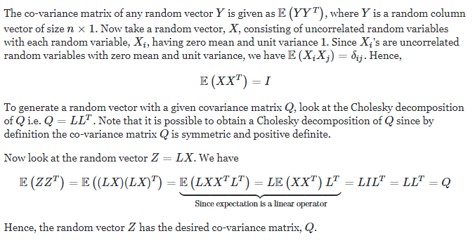

```{r setup, include=FALSE}
knitr::opts_chunk$set(echo = TRUE)
library(dplyr)
library(ggplot2)
```

Bron: [website](https://r-vogg-blog.netlify.app/) en [github](https://github.com/richardvogg)

# Simuleer afhankelijke data

## Gebaseerd op correlatie

Als we alleen met numerieke variabelen te maken hebben en een iets complexere verbinding tussen de variabelen willen hebben, kunnen we een andere benadering proberen, waarbij we vooraf een correlatiematrix specificeren en daarna onze variabelen herschikken zodat ze overeenkomen met de gewenste correlatie.

Natuurlijk moeten we redelijke correlatiewaarden vinden, bijvoorbeeld tussen leeftijd en aantal kinderen (waarschijnlijk licht positief gecorreleerd) of tussen besparingen en aantal kinderen (waarschijnlijk licht negatief gecorreleerd). Dit vereist wat onderzoek.

Eerst simuleren we de gegevens onafhankelijk.

```{r}
set.seed(64)
k <- 2000
age <- rnorm(k, mean = 35, sd = 10) %>% pmax(18) %>% round()
balance <- rexp(k, rate = 0.001) %>% round(2)
tenure <- rnorm(k, mean=15, sd = 5) %>% pmax(1) %>% round()
kids_cnt <- sample(0:6, k, replace =T, prob = c(100,120,80,30,5,2,1))
data <- data.frame(age, balance, kids_cnt, tenure)

data %>% head(7)
```

We zien direct dat er dingen zijn die niet zo logisch zijn, zoals de 22-jarige met een ambtstermijn van 22 jaar. Verder is er geen afhankelijkheid tussen de variabelen.

Om dit te verbeteren, willen we de rijen herschikken en een correlatie krijgen die dicht bij een gewenste correlatie ligt. Eerst simuleren we een helpende dataset van dezelfde grootte, waarbij elk item normaal willekeurig is verdeeld. 

```{r}
#same size
nvars <- ncol(data)
numobs <- nrow(data)
set.seed(3)
rnorm_helper <- matrix(rnorm(nvars*numobs, 0, 1), nrow = nvars)
```

De correlatie van deze matrix moet dicht bij de identiteitsmatrix liggen.

```{r}
cor(t(rnorm_helper))
```

Vervolgens specificeren we onze gewenste correlatiematrix. Om dit onder woorden te brengen, willen we de vier variabelen leeftijd, balans, kids_cnt en tenure met elkaar in verband brengen. Elke variabele met zichzelf heeft een correlatie van 1. We willen dat leeftijd en balans een positieve correlatie hebben van 0,3, leeftijd en kids_cnt van 0,4 en leeftijd en ambtstermijn van 0,2. Evenzo specificeren we alle gewenste correlaties tussen paren variabelen. 

```{r}
Q <- matrix(c(1,0.3,0.4,0.2,  0.3,1,-0.3,0.3,  0.4,-0.3,1,-0.3,  0.2,0.3,-0.3,1), ncol = nvars)
Q
```

We kunnen nu de rnorm_helper-matrix vermenigvuldigen met de Cholesky-decompositie van onze gewenste correlatiematrix Q. Waarom dit werkt, wordt uitgelegd in de volgende opmerking. Als u niet geïnteresseerd bent in wiskundige details, kunt u dit deel overslaan.



[Bron](https://math.stackexchange.com/q/163472))

```{r}
L <- t(chol(Q))
Z <- L %*% rnorm_helper
```

Goed, nu converteren we deze nieuwe gegevens naar een dataframe en geven het de naam van onze oorspronkelijke gegevens.

```{r}
raw <- as.data.frame(t(Z), row.names = NULL, optional = FALSE)
names(raw) <- names(data)
head(raw, 7, addrownums = FALSE)
```

De correlatie van deze dataset ligt dicht bij ons gewenste resultaat. 

```{r}
cor(raw)
```

Deze dataset `raw` heeft echter niets te maken met onze originele data. Het zijn nog steeds alleen getransformeerde willekeurige normale gegevens. Maar omdat we weten dat deze dataset de juiste correlatie heeft, kunnen we dit gebruiken om de rijen van onze andere dataset opnieuw te ordenen. 

En dan vervangen we gewoon de grootste waarde van de willekeurige normale dataset door de grootste waarde in onze dataset, de op een na grootste door de op een na grootste etc. We gaan kolom voor kolom en herhalen deze procedure.

```{r}
for(name in names(raw)) {
  raw <- raw[order(raw[,name]),]
  data <- data[order(data[,name]),]
  raw[,name] <- data[,name]
}
```

Laten we de correlatie van deze nieuwe dataset bekijken. Het ligt dicht bij onze gewenste correlatiematrix 'Q'. De belangrijkste reden voor het kleine verschil is dat onze variabelen minder waarden aannemen dan een willekeurige normaal verdeelde variabele (bijv. het aantal kinderen heeft alleen waarden tussen 0 en 6). 

```{r}
cor(raw)
```

Ter vergelijking: Dit was `Q`:

```{r,echo=FALSE}
Q
```


Onze laatste herschikte en correct gecorreleerde dataset wordt nu opgeslagen in `raw`.

```{r}
head(raw, 7, addrownums = FALSE)
```


**Slotopmerkingen**

+ Als de correlatiemethode je bevalt, kijk dan eens naar het `GenOrd` package dat iets professioneler is wanneer je met ordinale categorische variabelen werkt.

+ De Cholesky-decompositie is alleen mogelijk voor positief bepaalde matrices. Als dit niet het geval is en u accepteert een iets sterkere afwijking van uw gewenste correlatiematrix, dan is de eenvoudigste manier om 0,1, 0,2 enz. Bij de diagonalen op te tellen totdat u een positieve definitieve matrix krijgt. Merk op dat dit de correlatie tussen alle variabelen verlaagt.

```{r}
diag(nvars) * 0.1 + Q
```

+ Na het correlatieproces kan het handig zijn om enkele van uw gegevens handmatig te controleren om te zien of de waarneming zinvol is en - indien nodig - handmatige correcties uit te voeren.
